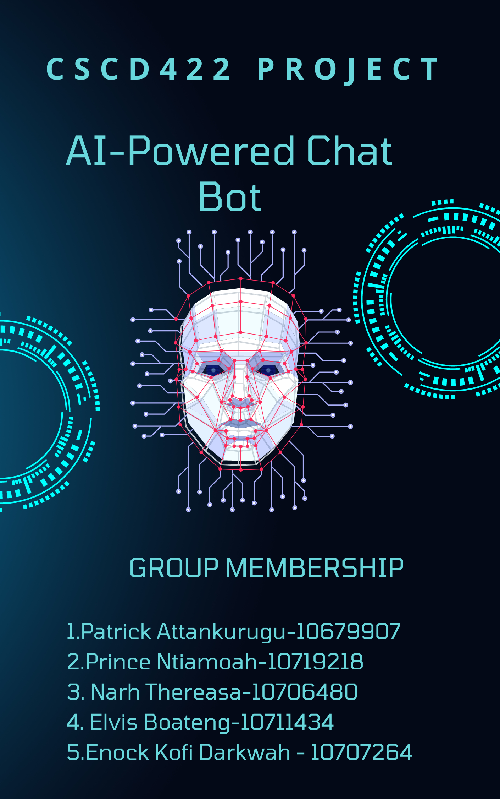

# AI-Powered 



This repo contains the code to a chatbot we created as part of the project requirements for the course CSCD422:Human Computer Interaction. Check out the project website  [here](https://github.com/python-engineer/pytorch-chatbot) 

## Deployment
We developed a stand-alone front-end and then created and then created an API that 
serves the model prediction
## Initial Setup:
Clone the repo and create a virtual environment
```
$ git clone https://github.com/ENOCK-KOFI-DARKWAH/AI-Powered-Chatbot.git
$ cd ai-powered-chatbot
$ python3 -m venv venv
$ . venv/bin/activate
```
## Install dependencies
```
$ (venv) pip install Flask torch torchvision nltk
```
Install nltk package
```
$ (venv) python
>>> import nltk
>>> nltk.download('punkt')
```
Modify `intents.json` with different intents and responses for your Chatbot

Run
```
$ (venv) python train.py
```
This will dump data.pth file. And then run
the following command to test it in the console.
```
$ (venv) python chat.py
```


